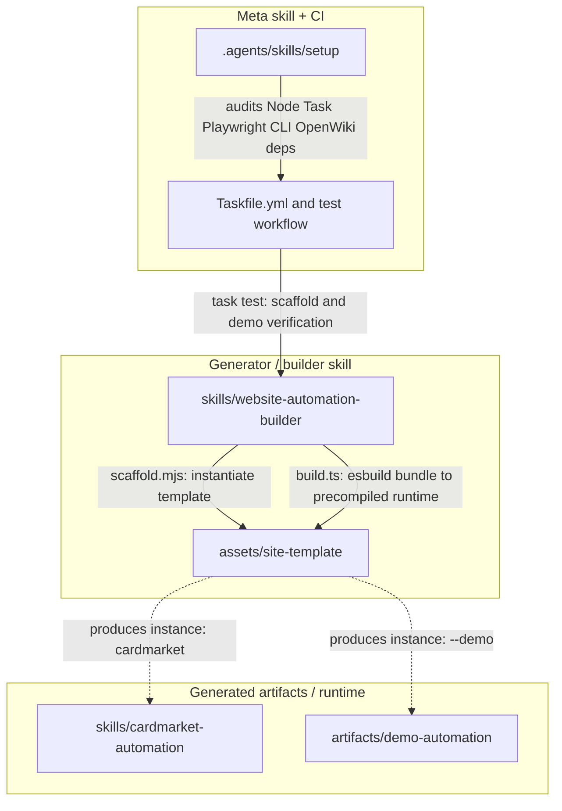

# Architecture overview

This repository is a collection of reusable agent **skills**, organized around a
single generation pipeline with one worked production instance and one
regression demo. The central distinction an agent must keep straight before
editing anything is **generator vs. product of generation vs. meta skill**:

- **Generator (builder).** `skills/website-automation-builder` — the reusable
  skill that *constructs* new portable website-automation skills. Editing it
  changes what every future generated skill looks like.
- **Product of generation.** `skills/cardmarket-automation` and
  `artifacts/demo-automation` — skills *emitted* from the builder's template.
  Editing them only changes that one site's automation; they do not feed back
  into the builder.
- **Meta skill (repo tooling).** `.agents/skills/setup` — an OpenCode skill that
  audits and prepares this repository for development. It is not generated by,
  nor fed into, the builder.
- **Repo-level setup/CI layer.** `Taskfile.yml`, `README.md`, and
  `.github/workflows/test.yml` — the entry points and the browser-free CI path
  that wire the generator's regression suite together.

The diagram below separates the three layers: builder (generator), generated
artifacts (runtime products), and meta skills + CI (repository tooling).

_Generation flow: the builder instantiates `site-template` and compiles it to a
precompiled runtime; `cardmarket-automation` and `demo-automation` are
independent instances of that template. The meta `setup` skill and `Taskfile.yml`
audit prerequisites and drive the generator's regression suite._

## The builder generator

`skills/website-automation-builder/SKILL.md` is the generator's control plane:
it instructs an agent to **build, repair, or extend portable website skills**
using registered TypeScript/Playwright Page-Object-Model (POM) actions, compact
observation, and a fixed local CLI (`node scripts/site-runtime.mjs`) that drives
the **already-open** browser via `playwright-cli`. The skill defines two modes:

- **Builder mode** — an explicit build/repair/extension task. This is the only
  mode in which the agent creates or modifies automation.
- **Normal Runtime** — answering an ordinary action request. It uses registered
  actions only, observes on drift, and never launches/replaces/closes a browser
  or improvises raw clicks/eval/navigation.

The builder's assets and references supply the generation material:

- `assets/site-template` — the canonical runtime template (package.json,
  `site.config.ts`, `SKILL.template.md`, `src/`, `tests/`) that a generated
  skill is instantiated from.
- `assets/demo` and `assets/examples` — a self-contained demo fixture and
  example POM/action files the builder uses for verification.
- `references/` — contracts that govern what the builder must produce:
  `generated-skill-contract.md`, `runtime-contract.md`,
  `observation-contract.md`, `pom-and-selectors.md`, `write-safety.md`,
  `verification.md`, `intake-and-discovery.md`, `sources.md`.
- `scripts/` — the generation tooling: `scaffold.mjs` (instantiate a target
  skill from the template), `test-scaffold.mjs` (builder regression),
  `test-demo.mjs` (full generated-demo verification), `preflight.mjs`.

The builder is itself a portable skill distributed via the repo's skill
installer (`npx skills add FabianSieper/skills --skill website-automation-builder`).

## The generated runtime (site-template)

`assets/site-template` is the source of truth for every generated skill. Its
`SKILL.template.md` is a placeholder-free control plane (only `{{HOST}}` /
`BUILD_REQUIRED` are filled) that tells the target's agent to use registered
actions, observe on drift, follow the state-driven `next` pointers, and treat the
browser as already open. Compilation is owned by `src/build.ts`, which
**uses esbuild once per build** to compile each domain action with its POMs, the
`SitePage`, and the browser entry into `runtime/actions/<id>.js`, keeps observe
code as a separate compiled artifact, and bundles the Node control plane into
`scripts/site-runtime.mjs`. The result is a **precompiled runtime**: after
distribution only Node >=22.16 and the pinned `playwright-cli` are required — no
npm install, TypeScript runtime, or esbuild at use time.

## Generated instances

`skills/cardmarket-automation` is the **production, live-verified** instance of
the template for Cardmarket (MTG). It is read-only, attaches to the
already-open browser via `playwright-cli` (never launches/replaces/closes one),
and exposes registered actions such as `cards.search`, `cards.price`, and
`cards.artworks`. Its `package.json` declares Node `>=22.16.0` (v0.2.0); its
locked dependencies are installed with `npm ci` during setup.

`artifacts/demo-automation` is the **regression demo** the builder's
`test-demo.mjs` scaffolds freshly into a temporary directory; it is exercised by
`task test` to prove the generator end to end (typecheck, build, unit, and
subprocess integration tests). It targets a local fixture at `127.0.0.1:4173`.
Neither generated instance feeds back into the builder: they are products of
generation, so changes to them do not affect the template.

## The meta skill and CI layer

`.agents/skills/setup` is the repository's **meta** skill (an OpenCode skill,
not a builder product). It brings a checkout to a usable state without
rewriting sources, manifests, lockfiles, or generated skills. It runs a
read-only audit (`node .agents/skills/setup/scripts/check.mjs`, aliased
`task setup:check`) that verifies, in dependency order: Git, Node `>=22.16.0`,
npm, Task (v3), the **pinned** `playwright-cli 0.1.19`, a global OpenWiki
package + executable, and the cardmarket lockfile. It installs only what is
missing and treats network, global npm, and out-of-checkout writes as
approval-bearing; it never runs `openwiki --init`, `playwright-cli attach`, or
browser/extension installation automatically, and never launches/replaces a
browser. An unexpected `playwright-cli` version is treated as incompatible, not
as an invitation to silently upgrade.

`Taskfile.yml` is the documented project entry point. Its `test` task runs
`scripts/test-scaffold.mjs` (the builder scaffold check) and
`scripts/test-demo.mjs` (a freshly generated demo's typecheck, build, unit, and
subprocess integration tests) — the **browser-free** path. `install:opencode`
installs all skills globally for OpenCode; `openwiki:update` refreshes this
wiki. The scheduled OpenWiki workflow and `.github/workflows/test.yml` document
the same browser-free CI path.

## Where to edit

- **Change what every generated skill looks like** → edit the builder
  (`skills/website-automation-builder/SKILL.md`, `assets/site-template`,
  `references/*`, `scripts/scaffold.mjs`).
- **Change one site's automation** → edit that generated skill
  (`skills/cardmarket-automation` or `artifacts/demo-automation`); it does not
  update the template.
- **Change repository bootstrap / prerequisites** → edit the meta skill
  (`.agents/skills/setup`, `Taskfile.yml`).

## Related pages

- `/openwiki/concepts/site-runtime.md`
- `/openwiki/concepts/skill-model.md`
- `/openwiki/quickstart.md`
- `/openwiki/skills/cardmarket-automation.md`
- `/openwiki/workflows/builder-generation.md`
