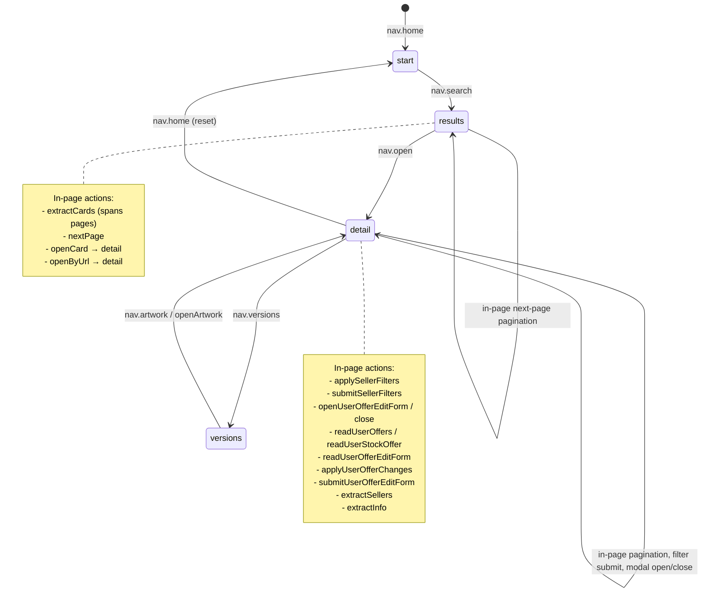

# Page Object Model and state-driven navigation

The generated runtime's state model treats each POM as a browser state (a page the agent can occupy). Transitions between states happen in two ways: **within a single POM** (in-page actions such as applying a filter, paginating, or opening a modal) and **across POMs** (navigation that returns a different page-object instance, e.g. search results → card detail). Every transition is expressed as a POM method that mutates the underlying `Page` and, when it crosses a page boundary, returns a new POM instance.

## The state model

The cardmarket instance defines four discrete states via the `StateId` type:

```ts
// skills/cardmarket-automation/src/types.ts
export type StateId = 'start' | 'results' | 'detail' | 'versions';
```

The builder's site-template generalizes this: every generated site's `SitePage` must implement `detectState()` (returning a stable string identifier), `regions()` (semantic name → locator map), and `visibleData()` (bounded summaries). The template version is intentionally unconfigured—it returns `"unknown"` and throws `NOT_CONFIGURED`—so that the scaffold signals what must be filled in.

State is derived purely from the current URL. `state.ts` maps URL patterns to state IDs:

```ts
// skills/cardmarket-automation/src/lib/state.ts
export function stateFromUrl(url: string): StateId {
  if (url.includes('/Products/Search?')) return 'results';
  if (url.includes('/Products/Singles/')) return 'detail';
  if (/\/Cards\/[^/]+\/Versions/.test(url)) return 'versions';
  return 'start';
}
```

`detectState(page)` is the thin wrapper that calls `stateFromUrl(page.url())`. Because state is a pure function of the URL, it is always observable even when domain assertions (e.g. Cloudflare, login) have failed—this is an invariant of the builder contract: `detectState`/`regions`/`visibleData` are "pure observations and remain usable after failed domain assertions."

## The state graph

The state graph is the union of all POM transitions and all action `next` pointers. Navigation actions carry a `next` array that tells the runtime which actions are valid from the resulting state.



*The state graph derived from POM methods and action `next` pointers. In-page actions keep the agent in the same state; navigation actions cross to a different POM.*

## POM base class: SitePage

`SitePage` is the shared base for all cardmarket page objects. It wraps a Playwright `Page` and provides three core responsibilities:

| Method | Responsibility |
|---|---|
| `assertReady()` | Verify the page is on an allowed origin, navigate to the base URL if blank or off-site, pass through any Cloudflare challenge, and return a stable `accountKey`. |
| `gotoAllowed(url)` | Resolve a relative or absolute Cardmarket URL, navigate with origin + Cloudflare guards. |
| `waitForCloudflare(timeoutMs)` | Poll the page title for Cloudflare challenge markers; resolve when the title is normal, throw `HUMAN_REQUIRED` when the challenge persists beyond the timeout (default 90 s). |

The origin guard is backed by `navigate()` in `guards.ts`, which validates the target URL against `config.allowedOrigins` both before and after `page.goto`. The URL resolution is done in `url.ts` via `resolveHref(href, base)`—a string-based implementation because the Playwright CLI browser runtime is a minimal VM without WHATWG `URL` globals.

```ts
// skills/cardmarket-automation/src/lib/url.ts
export function resolveHref(href: string, base: string = config.baseURL): string {
  if (!href) return '';
  if (/^https?:\/\//i.test(href)) return href;
  const root = base.replace(/\/$/, '');
  return href.startsWith('/') ? root + href : root + '/' + href;
}
```

## Page subclasses

Each cardmarket page subclass extends `SitePage` and encapsulates the selectors, parsing, and transitions specific to that browser state.

### SearchPage

Lives on a game page (`config.searchEntry`, e.g. `/en/Magic`) that still carries the search form. The 2026 "Search 2.0" redesign removed the form from the homepage; the game page is the reliable entry.

- **`openSearchEntry()`** — navigates to the search entry via `gotoAllowed`.
- **`search(query)`** — fills `#ProductSearchInput`, submits via native `form.requestSubmit()` (the site's autocomplete intercepts Playwright's `click`), waits for the results URL, and **returns a new `SearchResultsPage`**. This is a cross-POM transition.

### SearchResultsPage

Lives on `/en/Magic/Products/Search?category=-1&searchString=<q>&searchMode=v2`.

- **`extractCards(limit)`** — reads up to `limit` result tiles (`a.galleryBox`), spanning pages as needed via `nextPage()`. Dedupes by detail URL.
- **`nextPage()`** — reads the `a.pagination-control[data-direction="next"]` href, navigates via `gotoAllowed`. In-page transition.
- **`openCard(index)`** — clicks a result tile, waits for the detail URL, **returns a new `CardDetailPage`**. Cross-POM transition.
- **`openByUrl(url)`** — navigates directly to a detail URL, **returns a new `CardDetailPage`**.

### CardDetailPage

Lives on `/en/Magic/Products/Singles/<Set>/<Card>`. This is the richest page object in the cardmarket instance.

**Reading (in-page, stays on detail):**
- `extractInfo()` — parses the top block (`dl` of `dt`/`dd` pairs) into a `CardInfo` struct.
- `extractSellers(limit)` — reads seller rows (`main .article-row`) into `SellerOffer[]`.
- `versionsUrl()` / `hasVersions()` — reads the "Show Versions" link.
- `openVersions()` — navigates to the versions page (cross-POM, but the action layer manages the return).
- `hasFilterForm()` / `readCurrentFilter()` — reads the seller-filter form state.
- `readUserOffers(card, set, limit)` — reads `stockRow` user-offer rows.
- `readUserStockOffer(articleId, card, set)` — reads a single user-offer row.

**Writing (in-page, modal, stays on detail):**
- `openUserOfferEditForm(articleId)` — clicks the edit link, waits for the modal + form to be visible.
- `readUserOfferEditForm()` — reads the current form values into an `OfferFormState`.
- `closeUserOfferEditForm()` — presses Escape, verifies the modal is hidden.
- `applyUserOfferChanges(changes)` — sets form fields (condition, language, foil, signed, altered, comments, price, quantity).
- `submitUserOfferEditForm()` — clicks submit, waits for the modal to close, checks for validation errors.
- `prepareUserOfferUpdate(...)` → `executeUserOfferUpdate(...)` — the plan/execute write-safety pattern: open the form, read the current state, close it, return a `Preview`; then reopen, verify the state has not changed (`sameFormState`), apply changes, submit, and check postconditions.

**Filtering (in-page, stays on detail):**
- `applySellerFilters(filter)` — sets filter form fields (condition, language, country, seller type, foil, signed, altered). Expands the country list if needed.
- `submitSellerFilters()` — clicks the apply button, falls back to `requestSubmit()`.
- `settleSellerList(timeoutMs)` — waits for the seller list to re-render after filter submission.

### CardVersionsPage

Lives on `/en/Magic/Cards/<Card>/Versions` (the full list is rendered on one page; no pagination).

- **`listArtworks()`** — reads every version/artwork tile (`a.card[href*="/Products/Singles/"]`) into `Artwork[]`.
- **`openArtwork(index)`** — clicks a version tile, waits for the detail URL, **returns a new `CardDetailPage`** (the versions → detail transition).
- **`totalFromHeading()`** — reads the "N versions" count from the `h1`.
- **`cardFromUrl()`** — extracts the card name from the current URL.

Reachable from `CardDetailPage.openVersions()` and the `nav.artwork` action.

## Selector and guard discipline

The builder contract (`references/pom-and-selectors.md`) establishes a strict selector policy that every POM must follow:

1. **Locator priority**: (1) data attributes / stable IDs, (2) exact `getByRole`/`getByLabel`, (3) business ID inside a uniquely identified container, (4) stable short attribute with a recorded reason.
2. **Uniqueness checks**: every interaction target must be verified with `uniqueVisible`/`clickUnique`/`fillUnique`—the count must be exactly one. A missing target is `UI_DRIFT`; multiple matches are `AMBIGUOUS_SELECTOR`.
3. **Prohibited patterns**: no `first`/`last`/`nth`, no long XPath, no generated class selectors, no `force: true`, no coordinate clicks, no arbitrary sleeps, no silent locator fallbacks.
4. **Origin guards**: `navigate()` checks `config.allowedOrigins` before and after navigation.
5. **Control-plane isolation**: the CLI and prompts contain no site selectors; selectors are owned exclusively by page objects.

`guards.ts` implements the core guard functions:

```ts
// skills/cardmarket-automation/src/runtime/guards.ts
export async function uniqueVisible(locator, step, timeout = 15_000) {
  // waits for visibility, then checks count === 1
  // throws UI_DRIFT (count === 0) or AMBIGUOUS_SELECTOR (count > 1)
}
```

## Filter objects

Filter state is managed by two module-level files that define value mappings and validation:

- **`seller-filters.ts`** — maps semantic filter values (e.g. `FilterLanguage`, `FilterYesNo`, `FilterSellerType`) to the HTML form's raw values, and provides `reverse*` functions for reading form state back into semantic values. `buildFilterTargets(filter)` produces the concrete DOM targets to set. `SELLER_FILTER_DEFAULTS` provides the fully-defaulted filter.
- **`user-offer-filters.ts`** — maps `OfferCondition` and `OfferLanguage` enum keys to form values and display labels. Used by `CardDetailPage.applyUserOfferChanges` and `executeUserOfferUpdate` for validation and postcondition checks.

These files keep the POM free of raw value literals and centralize the validation that prevents `INVALID_INPUT` errors.

## URL construction and parsing

`url.ts` provides string-based URL helpers (the Playwright CLI browser runtime is a minimal VM without WHATWG `URL`):

- **`originOf(value)`** — extracts `https://host` via regex.
- **`isAllowedOrigin(value)`** — checks against `config.allowedOrigins`.
- **`resolveHref(href, base)`** — resolves a relative or absolute href against the base URL.

`parse.ts` provides locale-tolerant display-string parsers:

- **`parseQty(s)`** — strips non-digits from a quantity display string (handles space-grouped `"1 500"` and comma-grouped `"1,500"`).
- **`parsePrice(s)`** — extracts the numeric portion before `€`, normalizes the comma decimal separator (`"1 234,56 €"` → `1234.56`). Returns `null` when unparseable.

These are used by POM methods for postcondition verification (e.g. checking that a price change was applied correctly).

## Documentation–code state alignment

A key invariant from the builder contract and the repository's TODO list is that **the stages documented in references must match the states in code**. The builder's site-template `references/flows.md` carries the instruction:

> `BUILD_REQUIRED: Record starting state, identity, business steps, expected state and recovery action for each flow.`

In the cardmarket instance, `references/flows.md` documents each flow's starting state, steps, expected state, and recovery actions for error cases (`UI_DRIFT`, `AUTH_REQUIRED`, `HUMAN_REQUIRED`, `PLAN_CHANGED`, `PLAN_USED`, `UNKNOWN_COMMIT`). `references/selectors.md` documents the page-object boundary. `references/build-state.json` tracks live-verification evidence per state.

The `StateId` type, `detectState()`, and each POM's URL pattern together form the code-side definition of states. The flows document mirrors these states: a flow that starts on `detail` and ends on `detail` (e.g. `user.offers`) is an in-page transition; a flow that moves from `results` to `detail` (e.g. `nav.open`) is a cross-POM transition.

**Selector/stage alignment is an invariant to preserve.** If a POM's selector or state-detection pattern changes, the corresponding flow documentation, action `next` pointers, and `StateId` values must be updated in the same change. The builder contract explicitly states that `detectState`/`regions`/`visibleData` are pure observations that remain usable after failed domain assertions—meaning the state layer must not be coupled to business-logic success/failure.

## Extension points

- **New states**: add a new `StateId` value, extend `stateFromUrl` with the URL pattern, create a new POM subclass extending `SitePage`, and register navigation actions with appropriate `next` pointers. Update `references/flows.md` in the same change.
- **New in-page actions**: add methods to the existing POM subclass. The action layer registers them with `next` pointing back to the same state's actions.
- **New filter objects**: follow the pattern in `seller-filters.ts` / `user-offer-filters.ts`—value mappings, defaults, `buildFilterTargets`, and `reverse*` functions.
- **Builder-level changes**: edit the site-template `SitePage` contract (`detectState`, `regions`, `visibleData`, `assertReady`) and the `pom-and-selectors.md` reference to change what every future generated skill looks like.

## Failure semantics

| Error | Meaning | Raised by |
|---|---|---|
| `UI_DRIFT` | A selector target is missing (count = 0) or navigation origin is disallowed. | `guards.uniqueVisible`, `SitePage.gotoAllowed` |
| `AMBIGUOUS_SELECTOR` | Multiple elements match a selector (count > 1). | `guards.uniqueVisible` |
| `HUMAN_REQUIRED` | A Cloudflare challenge persisted beyond 90 s; the operator must solve it manually. | `SitePage.waitForCloudflare` |
| `UNSUPPORTED_UI_STATE` | `detectState` returned a value that does not match any known state (template: `"unknown"`). | Site-template `SitePage` |
| `NOT_CONFIGURED` | The site-template's unconfigured `assertReady` was called before the BUILD_REQUIRED placeholders were filled. | Site-template `SitePage.assertReady` |
| `PLAN_CHANGED` | The form state at execute time does not match the preview captured at plan time. | `CardDetailPage.executeUserOfferUpdate` |
| `POSTCONDITION_FAILED` | A business postcondition (e.g. price, quantity, condition) was not met after a write. | `CardDetailPage.executeUserOfferUpdate`, action-layer `validateOutput` |
| `BROWSER_REQUIRED` | No browser is attached (hard stop). | Runtime CLI |
