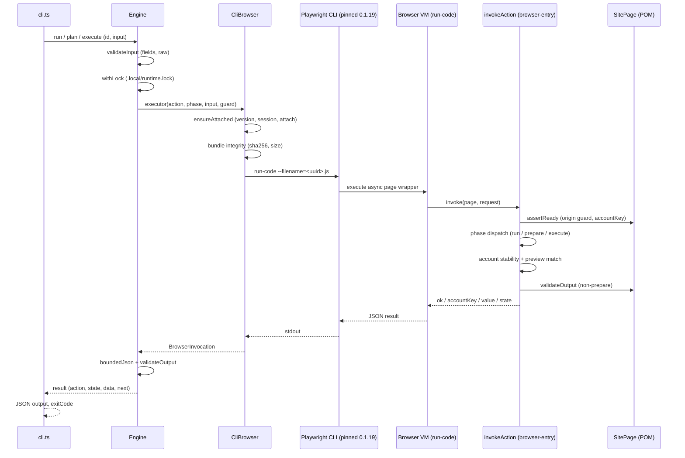

# Site runtime and execution contract

The generated runtime is the single most important subsystem for making safe changes to a website automation project. It is a reusable engine — `engine.ts`, `cli-browser.ts`, `browser-entry.ts`, `manifest.ts`, `observation.ts`, plus the supporting `input`, `fingerprint`, `guards`, `errors` modules — that every generated site inherits from the `website-automation-builder` template. The engine never talks to Playwright directly; it drives a **pinned Playwright CLI (version `0.1.19`)** that is attached to a browser the user has already opened. All business logic lives in precompiled per-action bundles, and every write is gated by a signed, single-use, TTL-bounded approval plan. The runtime's invariants are:

- **Attach-only.** The user's browser is already open. The runtime never launches, replaces, or closes a browser.
- **Deterministic waiting.** Waiters use bounded timeouts (`waitFor`, `waitUntil: "domcontentloaded"`), not sleep or polling.
- **Write safety.** Writes follow a plan → approve → execute flow; no commit occurs without an exact stored plan and its approval hash, and a plan is single-use.
- **Determinism.** Inputs, previews, and outputs are canonicalized and hashed; config drift invalidates a plan.

This page documents the engine's responsibilities, entrypoints, mechanisms, relationships, state/lifecycle, invariants/failures, extension points, and configuration. Source code and tests are authoritative: `skills/website-automation-builder/assets/site-template/src/runtime/`, `skills/website-automation-builder/assets/site-template/src/build.ts`, and `skills/website-automation-builder/assets/site-template/src/validate-build.ts`.

## Architecture and component roles

The runtime splits cleanly into four roles:

| Module | Responsibility |
|---|---|
| `cli-browser.ts` — `CliBrowser` | The **only** browser transport. Drives the pinned Playwright CLI: version check, attach, bundle integrity, `run-code` execution. No shell, no browser driver, no runtime compiler. |
| `engine.ts` — `Engine` | Local control plane: action registry validation, input validation, locking, plan creation/verification, output postcondition and size bounds. Never touches the browser directly; delegates through a `BrowserExecutor` callback. |
| `browser-entry.ts` — `invokeAction` | The precompiled per-action entry point that runs **inside the CLI's browser VM**: origin guard, `SitePage.assertReady()`, phase dispatch (run/prepare/execute), account-stability and preview-match checks, output validation. |
| `observation.ts` — `observe` | Fixed read-only DOM projection (`browser.status`, `browser.inspect`, `browser.inspectRegion`, `browser.screenshot`); no caller-supplied JS or selectors. |

Supporting modules: `manifest.ts` (typed `Manifest`/`Bundle`/`RuntimeSettings`), `input.ts` (field definition + validation + canonical JSON + `digest`), `fingerprint.ts` (`implementationFingerprint`), `guards.ts` (`uniqueVisible`/`clickUnique`/`fillUnique`/`allowedURL`/`navigate`), `errors.ts` (`AutomationError`, `ErrorCode`, `normalizeError`, `exitCode`, `recovery`).

## Entrypoints

- `src/cli.ts` — the compiled CLI. Reads `runtime/manifest.json`, constructs `CliBrowser` + `Engine`, parses strict positional args, and dispatches: `list`, `describe`, `status`, `inspect`, `inspect-region`, `screenshot`, `doctor`, `cleanup`, `run`, `plan`, `execute`.
- `src/build.ts` — Builder-mode only. Compiles each action and the observation bundle with esbuild into `runtime/actions/*.js` and `runtime/browser.observe.js`, writes `runtime/manifest.json`, and bundles `src/cli.ts` into the portable `scripts/site-runtime.mjs`.
- `src/validate-build.ts` — Builder-mode only. Verifies the build is complete and consistent (config, registry, manifest fingerprint, bundle integrity, build-state, banned patterns) and reports `ready` or a failure.

## Runtime request flow

The mermaid sequence below documents the full path for a domain action request: CLI input → manifest/observation → action → build-state → output.



*The request flow from CLI input through manifest/observation, action, build-state, and output. Reads skip the plan; writes insert plan → approve → execute between prepare and commit.*

## Attach-only invariant

`CliBrowser.ensureAttached()` is the heart of the attach-only contract:

1. **Version pin.** `--version` must equal `config.browser.cliVersion` (`"0.1.19"`). A mismatch throws `CLI_PROTOCOL` (`playwright-cli-version`).
2. **Session lookup.** `list --json` is parsed (`parseSessions`); the named session `config.browser.session` is located. If present and compatible (`status === "open"`, `attached === true`, `compatible === true`, and for `extension` mode `browserType === target`), attach is skipped.
3. **Attach config.** The attach mode must be `extension` or `cdp`; anything else throws `ATTACH_FAILED` (`attach-config`).
4. **No browser launch.** For `extension` mode, `requireRunningBrowser(target)` shells out to `ps`/`tasklist` and **refuses before invoking** the CLI extension attach if the user's browser is absent — the CLI extension attach would otherwise open its connection URL through the browser executable. CDP never launches.
5. **Attach + verify.** `attach --<mode>=<target> --session=<session>` is invoked, then the session is re-checked; a non-compatible result throws `ATTACH_FAILED` (`session-not-attached`).

The `config.browser` block in `site.config.ts` carries the invariant: `cliCommand: "playwright-cli"`, `cliVersion: "0.1.19"`, `attach: { mode, target }`, `session`. The comment in the config is explicit: *"Runtime invariant: the user's browser is already open. Never launch another browser."*

The `CliBrowser` constructor accepts a `cliScript` override (a bundled JS driven through `process.execPath`) for the portable `scripts/site-runtime.mjs` deployment, but the protocol is unchanged.

## Deterministic waiting

Waiting is deterministic throughout the runtime:

- `guards.uniqueVisible(locator, step, timeout = 15_000)` calls `locator.waitFor({ state: "visible", timeout })`, then asserts `locator.count() === 1`. A failed wait throws `AMBIGUOUS_SELECTOR` (count > 1) or `UI_DRIFT` (no match). Subsequent Playwright actions stay strict.
- `guards.clickUnique` / `guards.fillUnique` wrap `uniqueVisible` and then call `.click` / `.fill` with the same bounded timeout.
- `guards.allowedURL(url, allowedOrigins)` validates the origin against `config.allowedOrigins` (a string-based check because the CLI VM has no WHATWG `URL` global). `guards.navigate` calls `page.goto(url, { waitUntil: "domcontentloaded" })` and re-validates the resulting origin.
- Action bundles set `page.setDefaultTimeout(config.timeoutMs)` before dispatch.
- `validate-build.ts` **bans** non-deterministic patterns in `src/`: `first`/`last`/`nth`, `force: true`, `waitForTimeout`, `xpath=`, `.mouse.`, `launchPersistentContext`, and `connectOverCDP`.

## Write safety and the plan lifecycle

Writes are the highest-risk operations and are governed by a signed, single-use, TTL-bounded plan:

- **`Engine.plan(id, raw)`** — for a `kind: "write"` action: validate input, call the browser with phase `prepare`, validate the returned `Preview` (`{ target, version, changes }`), and persist a `Plan` record to `.local/plans/<id>.json` with `format: 1`, a `configHash` (digest of config), `createdAt`, and `expiresAt = now + planTtlMs`. It returns `planId`, `approvalHash` (digest of the plan), the preview, and `requiresUserApproval: true` with the instruction *"Show this preview and stop. Execute only after explicit user approval."*
- **`Engine.execute(id, approval)`** — the approval token must be a UUID and a 64-hex hash. The engine:
  1. Rejects if an attempt marker already exists (`PLAN_USED`).
  2. Loads the plan; verifies `digest(plan) === approval`, `format === 1`, and `plan.id === id`.
  3. Rejects if expired (`PLAN_EXPIRED`) or if `configHash` changed (`PLAN_CHANGED`).
  4. Re-prepares in the browser and verifies `accountKey` and preview digest are unchanged (`PLAN_CHANGED`).
  5. Writes a single-use attempt marker (exclusive `wx`); a collision throws `PLAN_USED`.
  6. Calls the browser with phase `execute`, passing `{ accountKey, preview, expiresAt }` as the guard.
  7. On success, marks the attempt `completed`, deletes the plan, and returns the validated output.
  8. On failure, deletes the plan and throws `UNKNOWN_COMMIT` — *"A write may have happened. Do not retry; verify the business state with a read action."*

The `browser-entry.invokeAction` mirrors the guard inside the browser VM: for phase `execute` it re-prepares and compares the current preview to the guard's preview (canonical `sameValue`), checks `expiresAt`, and verifies account stability before and after the action. A mismatch returns `PLAN_CHANGED`; expiry returns `PLAN_EXPIRED`.

### Write-safety error semantics

The `errors.ts` module maps each `ErrorCode` to a human-readable message, an exit code, and a recovery strategy:

| Code | Exit | Recovery | Meaning |
|---|---|---|---|
| `PLAN_CHANGED` | 4 | `replan` | Account, target, state, input, or implementation changed. |
| `PLAN_EXPIRED` | 4 | `replan` | Plan TTL elapsed; create a new plan. |
| `APPROVAL_REQUIRED` | 3 | `user-action` | Exact stored plan + approval hash required. |
| `PLAN_USED` | 5 | `inspect-state` | Plan already attempted; check business state. |
| `UNKNOWN_COMMIT` | 5 | `inspect-state` | A write may have happened; do not retry. |
| `AUTH_REQUIRED` | 3 | `user-action` | Browser not authenticated as required account. |
| `HUMAN_REQUIRED` | 3 | `user-action` | Manual interaction required; do not bypass. |
| `BROWSER_REQUIRED` | 3 | `user-action` | Configured browser must already be open. |
| `ATTACH_FAILED` | 3 | `user-action` | Could not attach to the open browser/session. |
| `CLI_PROTOCOL` | 4 | `repair` | Playwright CLI returned an unexpected result. |
| `UI_DRIFT` | 4 | `inspect-state` | Observed UI no longer matches the documented flow. |
| `AMBIGUOUS_SELECTOR` | 4 | `inspect-state` | Locator matches more than one element. |
| `POSTCONDITION_FAILED` | 4 | `repair` | Result or business state could not be verified. |
| `BUILD_REQUIRED` | 4 | `repair` | Precompiled runtime missing/stale/damaged; rebuild. |
| `NOT_CONFIGURED` | 4 | `repair` | Implementation/verification incomplete. |
| `BUSY` | 4 | `inspect-state` | Runtime lock held by another process. |
| `TIMEOUT` | 4 | `inspect-state` | Bounded operation timed out. |
| `INTERNAL` | 4 | `inspect-state` | Generic failure; inspect diagnostics. |
| `INVALID_INPUT` | 2 | `fix-input` | Invalid input. |
| `UNKNOWN_ACTION` | 2 | `fix-input` | Unknown or unsupported action. |

`normalizeError` maps raw errors: Playwright strict-mode violations → `AMBIGUOUS_SELECTOR`; `TimeoutError` → `TIMEOUT`; anything else → `INTERNAL`. The CLI's error response includes `recovery` and, for `PLAN_USED`/`UNKNOWN_COMMIT`, `mayHaveCommitted: true`.

## Build-state and fingerprint

Two mechanisms bind the runtime to its source so that a stale or tampered build is detected:

- **`implementationFingerprint(project)`** (`fingerprint.ts`) walks `src/` (rejecting symlinks), plus `site.config.ts`, `package.json`, and `package-lock.json` (if present), and hashes every file path and content in sorted order into a single SHA-256. This is the `buildHash` stored in `runtime/manifest.json`.
- **Bundle integrity.** Each precompiled bundle (`actions/<id>.js`, `browser.observe.js`) carries a `sha256` in the manifest. At invoke time, `CliBrowser.invoke` re-reads the bundle, recomputes the hash, and rejects any mismatch or size overrun (`BUILD_REQUIRED`, `bundle-integrity`).
- **`validate-build.ts`** ties these together: it verifies `manifest.buildHash === implementationFingerprint(project)` (`stale-build`), that manifest action IDs match the registered actions (`manifest-registry`), that every bundle's SHA matches and starts with `async (page, request) =>` (`bundle-integrity`), and that the portable runtime script contains no banned runtime dependencies (`runtime-portability`). It also checks `references/build-state.json` is at phase `HANDOFF` with per-action evidence (`mapped`, `implemented`, `fixture`, `live` + `remainingRisk` when `live === "not-run"`).

## Observation contract

`observe(page, site, request, origins)` produces a fixed read-only DOM projection. No caller-supplied JS or selectors are executed.

- **`browser.status`** — always available, even outside the site: sanitized URL, title (160 chars), and `pageState` (`detectState()` if in-scope, else `"outside-site"`).
- **`browser.inspect`** — requires in-scope origin (else `UNSUPPORTED_UI_STATE`). Runs `summarize` on `body`: bounded `headings`, `dialogs`, `importantControls` (with role/name/disabled), plus `regions` (up to 20 keys) and `visibleData` (up to 8 entries, each 64×120 chars).
- **`browser.inspectRegion`** — same, but rooted at a registered region locator; an unregistered region throws `UNKNOWN_REGION`.
- **`browser.screenshot`** — viewport-only (`fullPage: false`, 15 s timeout), written to a caller-supplied path.
- **Diagnostic mode** (`mode: "diagnostic"`) raises item limits (16 vs 8) and appends an `ariaSnapshot` (2400 chars) with `locatorCount` and `visible`.

A region locator that does not resolve to exactly one visible element throws `AMBIGUOUS_SELECTOR` (count > 1) or `UI_DRIFT` (count < 1 or not visible).

## Input validation and determinism

`input.ts` provides the field-definition schema and validation:

- `validateFields(fields)` — validates the contract definition: identifier-like names, non-empty descriptions, consistent min/max/enum constraints.
- `validateInput(fields, raw)` — validates a concrete input against the contract: rejects unknown fields, enforces required/type/length/enum/bounds, applies defaults, and returns a plain `Input` record.
- `jsonValue(value)` — deep-validates a value is plain JSON (no cycles, no foreign prototypes).
- `canonical(value)` — canonical JSON serialization (sorted keys, no whitespace) for stable hashing.
- `digest(value)` — SHA-256 of `canonical(jsonValue(value))`. Used for approval hashes, config hashes, plan verification, and preview comparison.

These are the building blocks that make plan verification, preview matching, and fingerprinting deterministic.

## Locking and local state

The engine serializes all browser-touching operations through a file lock:

- `acquireLock(root)` writes `.local/runtime.lock` (exclusive `wx`, 0600) containing `{ pid, startedAt }`. If the lock exists and is not stale (the recorded PID is alive, or the lock is < 5 min old), it throws `BUSY`. A stale lock is renamed aside and reclaimed.
- `withLock(root, job)` acquires, runs the job, and unlinks the lock in a `finally`.
- `cleanupLocal(root)` removes expired plans and stale `run-code` bundle files.

All local state lives under `.local/` (the `root`), with subdirectories: `plans/`, `attempts/`, `screenshots/`, `run-code/`. The CLI sets `process.umask(0o077)` so all created files are private.

## Configuration

`site.config.ts` is the single source of runtime configuration. Key fields:

| Field | Role |
|---|---|
| `name` / `session` | Project and Playwright CLI session name (must be equal). |
| `baseURL` / `allowedOrigins` | Base URL and the origin allowlist for navigation guards. |
| `timeoutMs` | Default Playwright timeout set on each bundle. |
| `actionBudgetMs` | Max CLI `run-code` execution time. |
| `planTtlMs` | Plan expiry window. |
| `maxInputBytes` / `maxOutputBytes` | Input/output size bounds. |
| `maxBundleBytes` | Max precompiled bundle size. |
| `maxCliBytes` | Max CLI stdout buffer. |
| `browser.cliCommand` / `cliVersion` | Pinned Playwright CLI command and version (`"0.1.19"`). |
| `browser.attach.mode` / `target` | Attach mode (`extension` or `cdp`) and browser target (e.g. `chrome`). |
| `configured` | Whether the site is fully implemented (gate for `CliBrowser.domain`). |

`validate-build.ts` enforces structural invariants on the config: `cliVersion` is semver, `session === name`, attach target/mode are set, `baseURL` origin is in `allowedOrigins`, and all byte/time budgets are positive safe integers.

## Extension points

The generated site extends the template at well-defined boundaries:

- **Actions** (`src/actions/*.ts`) — each registers an `Action` (kind `read` or `write`) with `run`/`prepare`/`execute` methods, a `parameters` field contract, `preconditions`, `postcondition`, `next`, and `validateOutput`. The build compiles each into a bundle; the manifest records its SHA-256.
- **`SitePage`** (`src/pages/SitePage.ts`) — must implement `assertReady()` (origin guard + accountKey), `detectState()`, `regions()`, and `visibleData()`. This is the POM base; see [POM and state](/openwiki/concepts/pom-and-state.md).
- **Observation** — the template's `observation.ts` is fixed; a site cannot inject custom JS. The `ObservationSite` interface (`detectState`, `regions`, `visibleData`) is the extension surface.
- **Guards** — `guards.ts` provides the deterministic wait/click/fill/navigate primitives that action POMs should use rather than raw Playwright calls.

## Failure and recovery model

Every failure in the runtime is a typed `AutomationError` with a `code`, optional `step`, and a deterministic recovery strategy. The CLI wraps all errors in a JSON envelope:

```json
{
  "ok": false,
  "error": "UNKNOWN_COMMIT",
  "step": "…",
  "recovery": "inspect-state",
  "mayHaveCommitted": true
}
```

The `mayHaveCommitted` flag is set only for `PLAN_USED` and `UNKNOWN_COMMIT`, signaling that a write may have partially occurred and the caller must verify business state with a read before any further action. The exit code (2, 3, 4, or 5) allows shell/CI to distinguish input errors from user-action-required failures from internal/repair failures from uncertain-commit states.

## Focused tests

The template ships test suites for each runtime module:

- `tests/engine.test.ts` — lock acquisition/staleness, plan lifecycle (create, verify, execute, expiry, config drift, single-use, uncertain commit).
- `tests/cli-browser.test.ts` — version pin, session attach, bundle integrity, `run-code` round-trip, error mapping.
- `tests/browser-entry.test.ts` — origin guard, account stability, preview match, phase dispatch.
- `tests/guards.test.ts` — `uniqueVisible` (single/ambiguous/drift), `allowedURL`, `navigate`.
- `tests/fingerprint.test.ts` — implementation fingerprint determinism, symlink rejection.
- `tests/input.test.ts` — field validation, input validation, canonical JSON, digest stability.
- `tests/cli.test.ts` — CLI arg parsing, command dispatch, error envelope, exit codes.

The demo project (`assets/demo/tests/runtime.integration.test.ts`) runs the full CLI against a fake Playwright CLI (`fake-playwright-cli.mjs`) and a fixture server, covering missing browser, failed attach, named-session reuse, CDP configuration, input validation, UI drift, compact observation, artifact integrity, and write failure/replay states.

## Relationships

- [POM and state](/openwiki/concepts/pom-and-state.md) — the `SitePage` POM base and state model that the runtime's `assertReady`/`detectState` depend on.
- [Playwright CLI integration](/openwiki/integrations/playwright-cli.md) — the pinned `0.1.19` CLI protocol: `--version`, `list --json`, `attach`, `run-code --raw`.
- [Verification](/openwiki/testing/verification.md) — fixture and live verification evidence recorded in `references/build-state.json`.
- [Runtime execution workflow](/openwiki/workflows/runtime-execution.md) — the end-to-end Builder → Build → Runtime → Handoff lifecycle.
