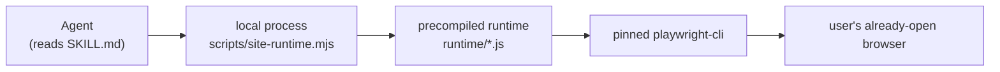

# Skill model and portability contract

Every skill in this repository — the reusable generator and each skill it emits —
is governed by one shared model. The model answers three questions before an
agent touches anything: **how much of a skill must be read to use it**,
**what an agent must be able to do to run it**, and **what a skill may and may
not require of the host harness**. Together these define progressive disclosure,
the portability constraint, and the no-extra-tools invariant. The
`references/` directory is the authoritative detail layer beneath the
`SKILL.md` control plane.

The two skills that instantiate the model are the two ends of the generation
pipeline. `skills/website-automation-builder` is the **generator**: it builds,
repairs, and extends portable website skills. `skills/cardmarket-automation` is
a **product of generation**: a concrete, guarded Cardmarket (MTG) automation
emitted from the builder's template. Both are shaped by the same contract,
which is why the model can be stated once.

## Progressive disclosure

A skill is consumed in layers, and the layers are deliberately unequal in size.

1. **Name + description (the registration layer).** Every `SKILL.md` opens with
   YAML frontmatter whose `name` and `description` fields are the skill's
   one-line advertisement. An agent can decide *whether* a skill applies from
   these two fields alone, without reading the body. This is the discovery
   signal: the builder's own frontmatter is
   `name: website-automation-builder` with a `description` that summarizes
   "Build, repair or extend portable website skills …"; the product's is
   `name: cardmarket-automation` with a `description` that summarizes "Guarded
   Cardmarket state-machine automation …".
2. **Full `SKILL.md` (the control plane).** Only when a task matches does an
   agent read the body. The contract is explicit that `SKILL.md` is a *short
   control plane*, not a manual: it tells the agent to choose registered
   actions, to use `list`/`describe` progressively and only when an action or
   its parameters are unknown, to observe when needed, to follow `next`
   pointers, to require the already-open browser, and to obtain exact plan
   approval for writes. Crucially it must **not** enumerate the whole registry
   and **not** teach Playwright, bundling, or selectors — that knowledge stays
   out of the control plane.
3. **`references/` (the authoritative detail layer).** Full parameter and output
   schemas, state-machine flows, the page-object boundary, verification status,
   and development evidence live here. For the product these are
   `references/actions.md`, `references/flows.md`, `references/selectors.md`,
   `references/verification.md`, and `references/build-state.json`. References
   are consulted when the agent needs to *extend* understanding — to look up an
   exact schema, a drift flow, or a write-safety rule — not on every normal
   call.

The layering is what makes a skill portable: an agent never has to read the
implementation source (`src/`) or the precompiled bundles (`runtime/`) to use
the skill. It reads the frontmatter, then the control plane, and reaches for
references only as detail demands.

## The portability constraint

The single most important invariant of the model is the portability constraint:
**an agent only needs to read `SKILL.md`, use local files, and start a local
process.** The builder states this directly — a generated skill's "only agent
requirements are reading SKILL.md, using local files and starting a process,"
and the generated skill may be "copy[ed] … to any skill location understood by
an agent; local process execution is sufficient."

Concretely, using a generated skill at runtime means running its fixed CLI from
the skill directory — `node scripts/site-runtime.mjs …` (or, in the product,
`npm run cli -- …`) — which drives the precompiled runtime. That is the entire
runtime path:



*The full runtime path the portability constraint allows: read SKILL.md, start
a local process, and let the precompiled runtime attach to the user's
existing browser. No harness tool, plugin, or source build sits in this path.*

The template `SKILL.template.md` makes the dependency floor explicit: "Use the
local CLI from this skill directory (Node >=22.16 and playwright-cli on PATH).
The distributed runtime is precompiled; no npm install is needed for normal
use." So the portability floor is **Node >=22.16 plus the pinned
`playwright-cli` on PATH** — nothing more. The skill may be copied to any
location an agent understands; it does not depend on a specific harness, a
global install, or the repository's build tooling.

## The no-extra-tools invariant

Portable is only true if a skill can never *pull the agent into* the host
harness. The model therefore enforces a no-extra-tools rule: **a generated
skill requires no harness-specific tools or plugins.** The builder's control
plane states it plainly — "No harness tools, MCP, plugins or special agent
permissions." The distribution contract is even more specific: a generated
skill needs **no `agents/openai.yaml`, no custom tool definitions, no MCP
configs, no harness SDKs, and no harness permissions**. (The cardmarket skill
does ship an `agents/openai.yaml`, but the contract is that such a file is
*unnecessary* — its presence is an agent-integration convenience, not a
portability dependency, and the skill must work without it.)

This invariant is what *constrains what may be added to a skill*. Any addition
that would make a skill depend on a particular agent's tool set — a custom MCP
tool, a harness permission, a plugin, a proprietary SDK call — is disallowed,
because it would break the "copy the directory and run a local process" promise.
The same reasoning keeps the *runtime* tool-neutral: the skill only ever shells
out to a standard local process (the Node CLI) and to the pinned
`playwright-cli`; it never calls a harness-provided function.

## The SKILL.md frontmatter contract

The `SKILL.md` frontmatter is the skill's identity and discovery surface. The
canonical shape is defined by the builder's template, `assets/site-template/SKILL.template.md`:

```
---
name: {{SLUG}}
description: Use registered website actions and compact browser observation on {{HOST}} in the user's already-open browser. BUILD_REQUIRED: add supported user intents.
---
```

Two fields and, by design, nothing else:

- **`name`** — the skill's stable slug (e.g. `cardmarket-automation`).
- **`description`** — a one-line summary of what the skill does and, when
  unconfigured, the `BUILD_REQUIRED` marker naming the intents still to be
  added. This is the field the discovery layer reads.

Because the frontmatter carries only `name` and `description`, the model has no
other required identity metadata; everything behavioral lives in the body and
references. (OpenWiki adds its own `type`, `title`, `tags`, and control fields
to the wiki page it renders for a skill; those are producer-owned and are not
part of the skill's `SKILL.md` contract.) The template body then carries the
fixed sections an agent relies on: the precompiled-CLI usage line, the command
list (`list`, `describe`, `run`, `status`, `inspect`, `inspect-region`,
`screenshot`, `doctor`, `plan`, `execute`), the "choose registered actions
first" guidance, the attach-only browser rule, the no-raw-commands rule, the
write-approval rule, and a pointer to `references/`.

## The reference-directory layout

Beneath `SKILL.md`, the `references/` directory is the authoritative detail
layer. The required layout, fixed by the distribution contract, is:

```
SKILL.md
scripts/site-runtime.mjs          # compiled Node entry point
runtime/manifest.json
runtime/actions/*.js              # domain + observation bundles
src/pages/ src/components/ src/actions/
src/runtime/ src/build.ts src/validate-build.ts
site.config.ts package.json package-lock.json tsconfig.json
references/actions.md flows.md selectors.md verification.md build-state.json
```

Each piece has a distinct role in the model:

- **`SKILL.md`** — the short control plane (above).
- **`scripts/site-runtime.mjs`** — the single compiled Node entry point; this
  *is* the "start a local process" half of the portability constraint. The
  runtime is precompiled so that normal use needs neither `node_modules` nor
  `src/`.
- **`runtime/manifest.json`** and **`runtime/actions/*.js`** — the precompiled
  domain and observation bundles and their typed manifest. These are *generated
  artifacts*: edit TypeScript and rebuild; never hand-edit the deployed bundle.
- **`src/`** (`pages/`, `components/`, `actions/`, `runtime/`, `build.ts`,
  `validate-build.ts`) — the maintained TypeScript sources, kept in the full
  handoff for repair even though the distributed runtime does not need them.
- **`site.config.ts`, `package.json`, `package-lock.json`, `tsconfig.json`** —
  configuration and dependency declarations (Node `>=22.16.0`).
- **`references/`** — the five document files. `references/actions.md` is the
  full parameter and output-schema reference; the product's is the definitive
  action table (e.g. the read `nav.*` transitions, `info`, `user.offers`, and
  the guarded `user.offer.update` write), with parameter ranges, output shapes,
  write-safety rules, and static `next` hints. `references/flows.md`,
  `references/selectors.md`, `references/verification.md`, and
  `references/build-state.json` carry the state-machine flows, the page-object
  boundary, verification status and known gaps, and per-action build evidence
  respectively.

The distribution rules round the contract out: build with `npm install`/`ci`,
`npm run build`, `npm run verify`; ship the compiled `scripts/` and `runtime/`
so list/describe and normal actions run without `node_modules` or `src/`; and
never distribute `.local`, `node_modules`, browser profiles, cookies,
credentials, or traces. The scaffold starts intentionally unconfigured; the
`--demo` flag overlays a deterministic local inventory fixture with two example
actions and is a *test* skill, not verified automation for a public website.

## Invariants that shape every change

Read together, the model yields the invariants that constrain any change to a
skill:

- **Portable.** Read `SKILL.md`, use local files, start a local process; Node
  >=22.16 and the pinned `playwright-cli` are the entire runtime dependency
  floor.
- **No extra tools.** No harness tools, MCP, plugins, SDKs, or special
  permissions may be required; a skill that needed them would not be portable.
- **Thin control plane.** `SKILL.md` lists/describes progressively and
  delegates detail to `references/`; it never teaches the implementation or
  enumerates the whole registry.
- **Precompiled, not hand-edited.** The distributed runtime is built from
  TypeScript; a change goes through edit-then-rebuild, never a manual bundle
  edit.
- **Authoritative references.** `references/` is the source of truth for
  schemas, flows, and evidence, and is the layer an agent reaches for to extend
  its understanding.

Any proposed addition should be tested against these: does it still run from a
copied directory with only a local process and the pinned CLI? If not, it
violates the portability and no-extra-tools invariants and must be rejected.

## Related pages

- `/openwiki/architecture/overview.md`
- `/openwiki/concepts/site-runtime.md`
- `/openwiki/skills/cardmarket-automation.md`
- `/openwiki/workflows/builder-generation.md`
