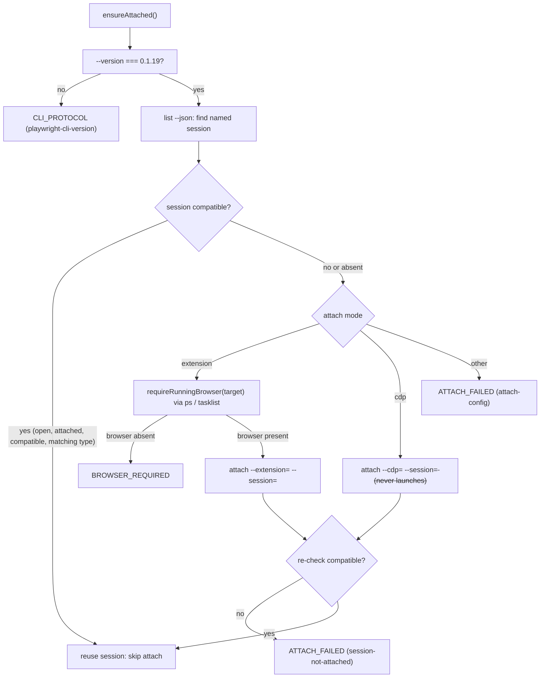

# Playwright CLI integration

The Playwright CLI is the external integration that makes the generated skills
work. It is a **user-scoped global command** (`playwright-cli`) on the user's
`PATH`, pinned to version **`0.1.19`**. Every generated site's runtime drives
this CLI as its **only** browser transport — it never talks to Playwright
directly, and it never shells out to a browser binary, a shell, or a runtime
compiler. The two invariants that define this integration are:

- **Version pin (invariant).** The CLI `--version` output must equal
  `config.browser.cliVersion` (`"0.1.19"`). A mismatch is treated as
  `CLI_PROTOCOL` (`playwright-cli-version`), failing closed. The pin is not an
  invitation to silently upgrade: an unexpected version is *incompatible*, not
  a candidate for auto-upgrade. Behavior is version-sensitive — in particular
  the double-encoding of `run-code --raw` string results documented below
  depends on `0.1.19`.
- **Attach-only (invariant).** The user's browser is already open. The runtime
  never launches, replaces, or closes a browser. There is no `open`, `launch`,
  `headless`, `profile`, or `close` fallback of any kind.

The pinned `playwright-cli` skill and its references (`SKILL.md` plus
`references/element-attributes.md`, `references/session-management.md`,
`references/storage-state.md`) live under the cardmarket copy at
`skills/cardmarket-automation/node_modules/playwright-core/lib/tools/skills/playwright-cli/`.
The runtime's binding to those commands and to the `0.1.19` protocol is the
subject of this page; the reusable engine that calls them is documented in
[Site runtime and execution contract](/openwiki/concepts/site-runtime.md).

## Role in the architecture

`CliBrowser` (`src/runtime/cli-browser.ts`) is the **only** component in the
runtime that touches the browser, and it touches it **only through the pinned
Playwright CLI**. All business logic lives in precompiled per-action bundles
that run *inside* the CLI's browser VM; `CliBrowser` serializes the bundle,
sends it to the CLI, and parses the bounded JSON result. The engine
(`Engine`) and the CLI entry point (`src/cli.ts`) never open a browser session
themselves — they delegate through a `BrowserExecutor` callback to
`CliBrowser.domain`. This is why the integration is a hard architectural
boundary: the CLI is the single seam between the user's existing browser and the
generated skill's precompiled code.

The CLI is a global, user-scoped dependency. The distribution floor for any
generated skill is **Node >= 22.16 plus the pinned `playwright-cli` on PATH** —
no npm install, TypeScript runtime, or esbuild at use time (see [Skill model
and portability contract](/openwiki/concepts/skill-model.md)). The
`config.browser` block in `site.config.ts` carries the pin and the attach
config, with an explicit comment: *"Runtime invariant: the user's browser is
already open. Never launch another browser."*

## Version pin and compatibility

The pin is enforced in `CliBrowser.ensureAttached()` before any other CLI call:

```ts
if ((await this.cli(["--version"], "list")) !== this.config.browser.cliVersion)
  throw new AutomationError("CLI_PROTOCOL", "playwright-cli-version");
```

Because the check is an exact string comparison against the configured
`"0.1.19"`, the runtime fails closed on any drift. Two consequences matter:

- **Strict, fail-closed.** There is no range, no semver operator, no
  auto-upgrade. If the user's installed CLI is `0.1.18` or `0.1.20`, the
  runtime refuses to run and reports `CLI_PROTOCOL`. `validate-build.ts`
  separately requires `cliVersion` to be a valid semver string.
- **Version-sensitive behavior is load-bearing.** The `run-code --raw` result
  decoding (below) compensates for a `0.1.19`-specific double encoding. Changing
  the pin without re-validating that behavior is unsafe.

The pinned skill references under the cardmarket `node_modules` copy document
the command surface the runtime relies on; the repo's builder references
(`references/sources.md`) record verification against the installed `0.1.19`
and its official help/source.

## Attach-only semantics

The attach contract is the heart of the integration, implemented in
`CliBrowser.ensureAttached()`. Its sequence is:

1. **Version pin** (above) — `--version` must equal `"0.1.19"`.
2. **Session lookup.** `list --json` is parsed (`parseSessions`, which expects
   a `{ browsers: [...] }` array); the named session
   `config.browser.session` is located. If it exists and is **compatible**
   (below), attach is skipped and the session is reused.
3. **Attach config check.** `config.browser.attach.mode` must be `extension` or
   `cdp`; anything else throws `ATTACH_FAILED` (`attach-config`).
4. **No browser launch (extension mode only).** Before invoking the extension
   attach, `requireRunningBrowser(target)` inventories OS processes
   (`ps -A -o comm=` on POSIX, `tasklist /FO CSV /NH` on Windows) and **refuses
   before invoking the CLI** if the configured browser process is absent. This
   matters because the CLI extension attach opens its connection URL *through
   the browser executable*, which would otherwise spawn a browser. A missing
   browser throws `BROWSER_REQUIRED`; an unreadable process inventory throws
   `ATTACH_FAILED` (`browser-presence-check`). CDP never launches.
5. **Attach + verify.** `attach --<mode>=<target> --session=<session>` is
   invoked, then the session is re-checked; a non-compatible result throws
   `ATTACH_FAILED` (`session-not-attached`).

The "compatible" predicate for a session is:

```ts
v.status === "open" && v.attached === true && v.compatible === true
  && (mode !== "extension" || v.browserType === target);
```

So a session is reusable only when it is open, attached, and reported
compatible by the CLI — and, in `extension` mode, when its `browserType`
matches the configured target. The builder notes that attached session metadata
may report `headed=false` even when the user's visible Chrome is in use; the
`attached`/`compatible`/`channel` checks, not the `headed` flag, are the
meaningful reuse signals.

Because the attach is *attach*, not *launch*, the invariant holds at every step:
no branch of `ensureAttached()` can start, replace, or close a browser. A
browser that is absent or that fails to attach is a hard user-action error
(`BROWSER_REQUIRED` / `ATTACH_FAILED`), not a fallback.



*The attach-only decision flow: version check, named-session reuse, and
process-presence-gated attach. No branch launches, replaces, or closes a
browser.*

## Session and storage-state management

The CLI's session model is what the runtime leans on for reuse and identity:

- **Named session.** `config.browser.session` must equal the project
  `config.name` (enforced by `validate-build.ts`). All CLI calls are scoped to
  this session with `-s=<session>`; `run-code` and observation calls always pass
  it explicitly.
- **Working-directory scoping.** `playwright-cli` scopes session state to its
  working directory. The runtime always invokes the CLI with
  `cwd: this.project` (the skill root), so it deterministically lands in the
  same session namespace regardless of where the caller invoked the CLI from.
- **Storage state.** The CLI persists each session's storage state (cookies,
  localStorage, etc.) under its session namespace. The runtime reads and reuses
  the user's existing browser state rather than provisioning a profile; it never
  distributes or creates browser profiles, cookies, or credentials as part of
  the skill (see the distribution rules in the skill model page). Because the
  attach is to an already-open browser, the account the user is logged in as is
  the account the runtime observes; a missing or wrong account is a typed error
  (`AUTH_REQUIRED`), not a browser restart.

## Observations and element attributes

The runtime obtains browser observations from the same pinned CLI, never from
raw, caller-supplied JavaScript or selectors. Two paths exist, both through
`run-code`:

- **Precompiled action results.** `CliBrowser.invoke(bundle, request)` reads the
  prebuilt `actions/<id>.js` bundle, verifies its SHA-256 and size
  (`BUILD_REQUIRED` on mismatch), serializes it into a
  `async page => { const invoke = <code>; return await invoke(page,
  <requestJson>); }` wrapper, writes it to a `wx` (exclusive) file under
  `.local/run-code/<uuid>.js`, and runs
  `-s=<session> --raw run-code --filename=<path>`. The prebuilt function owns
  all behavior; the wrapper is serialization only.
- **Fixed read-only observation.** `observation.ts` (`observe`) produces a
  fixed, bounded DOM projection (`browser.status`, `browser.inspect`,
  `browser.inspectRegion`, `browser.screenshot`) that runs through the same
  `run-code` path. A site cannot inject custom JS; the `ObservationSite`
  interface is the only extension surface.

Element attributes and the bounded DOM data (headings, controls with
role/name/disabled, regions, visible data) are obtained from this CLI-mediated
`run-code` execution against the user's live page. The bundled skill reference
`references/element-attributes.md` documents the CLI-side mechanism for reading
element attributes; the runtime consumes only the fixed projection the
observation bundle emits, so raw attribute scraping is never a runtime path.

### `run-code --raw` result decoding (version-sensitive)

`0.1.19`'s `--raw` flag **encodes a returned JSON string once more** as a JSON
string literal. The adapter decodes that outer layer before using the result:

```ts
let value = JSON.parse(stdout);
// CLI 0.1.19 --raw serializes a returned string once more.
if (typeof value === "string") value = JSON.parse(value);
```

After decoding, the runtime validates the envelope strictly: `value.ok` must be
`true` (a `false` envelope with a known error code is mapped to the matching
`ErrorCode`), `value.accountKey` must be a non-empty string, and the serialized
result must not exceed `maxOutputBytes`. Any violation throws
`CLI_PROTOCOL` (`run-code-output`). A malformed or unexpectedly-shaped result is
never accepted — the integration fails closed on protocol drift. This
double-decoding is the canonical version-sensitive behavior tied to the pin:
changing `cliVersion` without re-validating the `--raw` contract is unsafe.

The browser VM that executes `run-code` lacks the usual Node globals (`URL`,
`TextEncoder`, `Buffer`, `process`), so the precompiled code uses ECMAScript-only
origin and UTF-8 size checks rather than Node APIs (see
[runtime-contract](/openwiki/concepts/site-runtime.md)).

## Invocation and process model

The runtime shells out to the CLI with `execFile` (never a shell string),
binding each purpose to a bounded timeout and buffer:

- **Purpose `list`** — `--version` and `list --json`; 30 s timeout.
- **Purpose `attach`** — `attach --<mode>=<target> --session=<s>`; 30 s timeout.
- **Purpose `runtime`** — `run-code --filename=<path>`; bounded by
  `config.actionBudgetMs` (e.g. 90 s).

`maxBuffer` is always `config.maxCliBytes`. On failure the CLI's combined
stdout/stderr is classified: during `attach`, a "browser not running/open"
message maps to `BROWSER_REQUIRED`, any other to `ATTACH_FAILED`; during
`runtime`, failures map to `CLI_PROTOCOL`; `list` failures map to
`ATTACH_FAILED`. This classification is what turns a raw subprocess failure into
a typed, recovery-bearing runtime error.

For portable deployments (`scripts/site-runtime.mjs`), the `CliBrowser`
constructor accepts a `browser.cliScript` override: the bundled JS entry point
is then invoked through `process.execPath` instead of `playwright-cli` on PATH
(on Windows this avoids shell `.cmd` wrappers). The protocol is unchanged — the
override selects *how* the CLI is started, not *what* it does.

## Failure semantics and error mapping

Every failure in this integration is a typed `AutomationError` with a
`code`, a `step`, and a deterministic recovery strategy (see the full table in
[Site runtime and execution contract](/openwiki/concepts/site-runtime.md)). The
integration-specific codes are:

| Code | Step / trigger | Exit | Recovery |
|---|---|---|---|
| `CLI_PROTOCOL` | `playwright-cli-version`, `session-list`, `run-code-output`, runtime failure | 4 | `repair` — CLI returned an unexpected result or wrong version. |
| `ATTACH_FAILED` | `session-mismatch`, `attach-config`, `session-not-attached`, `browser-presence-check` | 3 | `user-action` — could not attach to the open browser/session. |
| `BROWSER_REQUIRED` | `browser-presence-check`, or CLI "browser not running/open" on attach | 3 | `user-action` — configured browser must already be open. |

The key operational consequence is the **missing-browser hard stop**: if the
user's browser is not open, or the attach cannot be established, the runtime
stops and asks the user to open the browser — it never substitutes a launch.
Because the attach is the only path and no branch may start a browser, a
browser-transport failure is always a user-action error, never an internal
recovery.

## Focused tests

The integration is exercised by the template's runtime test suites and the demo
integration:

- `tests/cli-browser.test.ts` — version pin, named-session attach/reuse,
  `BROWSER_REQUIRED` / `ATTACH_FAILED` mapping, bundle integrity, and the
  `run-code --raw` round-trip (including the double-decode).
- `tests/browser-entry.test.ts` — origin guard, account stability, and phase
  dispatch of the code that runs inside the CLI VM.
- The demo project (`assets/demo/tests/runtime.integration.test.ts`) runs the
  full CLI against a **fake Playwright CLI** (`fake-playwright-cli.mjs`) and a
  fixture server, covering missing browser, failed attach, named-session reuse,
  CDP configuration, compact observation, and `run-code` result mapping —
  without launching any real browser.

Fixture-based transport tests verify protocol and dispatch, not a real Chrome
attach; live attach/session-reuse evidence is recorded separately in
`references/verification.md` (see
[Verification](/openwiki/testing/verification.md)).

## Extension and change boundaries

The integration exposes a small, deliberate change surface:

- **`config.browser`** — `cliCommand`, `cliVersion`, `attach.mode`,
  `attach.target`, and `session` are the only knobs. Changing `cliVersion`
  requires re-validating the version-sensitive `--raw` contract and the
  session/attach behavior; changing `attach` switches the browser target or mode
  but never enables launch.
- **`browser.cliScript`** — the portable-deployment override for how the CLI is
  invoked; the protocol is unchanged.
- **No new transport.** A generated skill cannot add a second browser transport,
  a shell, or a runtime compiler; `CliBrowser` is the sole browser seam.
  `validate-build.ts` bans browser-launch patterns (`launchPersistentContext`,
  `connectOverCDP`, etc.) from `src/`.

## Operational notes

- The CLI must be installed at the pinned version and present on `PATH`. The
  meta setup skill (`.agents/skills/setup`, `Taskfile.yml`) audits for the
  **pinned** `playwright-cli 0.1.19` and treats an unexpected version as
  incompatible — it never auto-upgrades and never runs `playwright-cli attach`
  automatically (see
  [Setup and CI](/openwiki/operations/setup-and-ci.md) and
  [Cardmarket automation](/openwiki/skills/cardmarket-automation.md)).
- On Windows, configure trusted `browser.cliScript` to the installed
  `playwright-cli.js` entry point and rebuild; it is then invoked through Node
  via `execFile`, avoiding shell `.cmd` wrappers. There is no agent-provided
  executable override.
- All CLI state and the `run-code` wrapper files live under the skill's
  `.local/` directory, private (`0600`), and are cleaned up on exit; the
  wrapper file is unlinked in a `finally` so it never persists.

## Relationships

- [Site runtime and execution contract](/openwiki/concepts/site-runtime.md) —
  the reusable engine (`CliBrowser`, `Engine`, `browser-entry`, `observation`)
  that drives this CLI; full error table, plan lifecycle, and build-state.
- [Setup and CI](/openwiki/operations/setup-and-ci.md) — browser-free CI path
  and the pinned-CLI prerequisite audit.
- [Cardmarket automation](/openwiki/skills/cardmarket-automation.md) — the
  live-verified production instance of the template that uses this
  integration.
- [Skill model and portability contract](/openwiki/concepts/skill-model.md) —
  the portability floor (Node >= 22.16 + pinned CLI on PATH) this integration
  satisfies, and the no-extra-tools invariant it upholds.
- [Runtime execution workflow](/openwiki/workflows/runtime-execution.md) — the
  end-to-end Builder → Build → Runtime → Handoff lifecycle this integration
  serves at the runtime stage.
