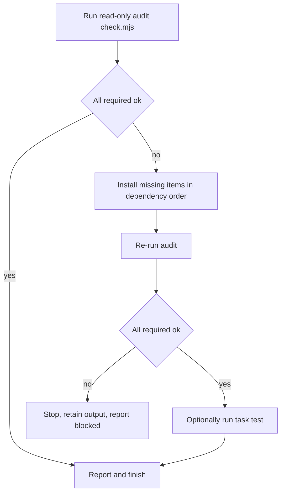

# Setup, prerequisites, and CI

The `/setup` skill brings a checkout to a usable state without changing project
source or configuration as a side effect of setup. Its contract is
**audit-then-install**: run a read-only audit first, install only the items the
audit reports as missing or incompatible, re-audit to confirm everything is
`ok`, and report. It is the one entry point that owns the full prerequisite set
— the `node .agents/skills/setup/scripts/check.mjs` audit is also published in
the README so it can be run directly. The GitHub Actions workflow and the
`Taskfile.yml` tasks document the same ground truth: the browser-free
regression path and the OpenWiki update path, respectively.

## Setup contract

The contract has four ordered obligations, captured by the skill and mirrored in
its workflow steps:

- **Audit before installing.** The audit is read-only. It reports each
  prerequisite's status and exits non-zero while a required item is missing or
  incompatible. It must run before any install.
- **Install only missing or incompatible items, in dependency order.** Setup
  does not reinstall what is already correct; it runs only the commands the
  audit requires, in the documented order (Task, Playwright CLI, OpenWiki, then
  local `npm ci`).
- **Re-audit.** After installs, the audit runs again and all required findings
  must be `ok`.
- **Report.** Setup reports installed versions, anything still blocked, and
  whether tests ran. It reports the Chrome extension as conditional.

Hard prohibitions that make the contract safe to run unattended:

- Never run `openwiki --init`, any OpenWiki authentication/integration command,
  `playwright-cli attach`, or browser/extension installation automatically.
  Those change repository, user, or browser state and need a separate explicit
  request.
- Never launch, replace, restart, or close a browser during setup.
- Treat network access, global npm installs, package-manager changes, and writes
  outside the checkout as **approval-bearing** operations in environments that
  require approval. Setup preserves dirty worktrees and may create ignored
  `node_modules`, but it must not rewrite manifests, lockfiles, generated
  skills, or user changes.

The version pin is load-bearing throughout: an unexpected `playwright-cli`
version is **incompatible**, not an invitation to silently upgrade the
repository. This checkout pins CLI protocol behavior to `0.1.19`. On a failed
install, setup stops, retains the output, and re-audits before trying a
different method; it does not work around permission errors with `sudo`, npm
ownership changes, or weakened security settings.



*Caption: The audit-then-install loop: read-only audit, install only what is
missing or incompatible, re-audit, then report.*

## The audit (`check.mjs`)

`node .agents/skills/setup/scripts/check.mjs [--root <path>] [--json]` is the
read-only audit. It locates the repository root (identified by `Taskfile.yml`,
`README.md`, `skills/website-automation-builder`, and
`skills/cardmarket-automation/package.json`), then emits one finding per
prerequisite. Each finding carries an `id`, a `status` (`ok`, `missing`,
`incompatible`, `blocked`, `unknown`, or `not-configured`), whether it is
`required`, the `expected` value, the `found` value, and a suggested `fix`.
The report is `ok` when every *required* finding is `ok`; the process exits `1`
otherwise (and `2` when no repository root can be found). `--json` emits the
structured report for machine consumption.

Audit mechanics worth noting:

- **Node** is compared against the minimum `22.16.0` via a numeric
  major/minor/patch comparison (`node --version` semantics).
- **Git, Task, npm, and Playwright CLI** are `commandFinding`s: the executable
  is resolved on `PATH`, the `--version` command is run, and the result is
  accepted by a predicate. Playwright CLI uses an **exact** string match against
  `0.1.19`, so any other version is `incompatible`.
- **OpenWiki** is `ok` only when both its global npm package (read from
  `npm ls -g --depth=0 --json`) and its executable on `PATH` are present. Setup
  never runs OpenWiki's interactive CLI as a health check.
- **Cardmarket dependencies** are checked by running `npm ls --depth=0 --json`
  in `skills/cardmarket-automation`; a failure is `missing` (or `blocked` if
  npm itself is unavailable).
- **Chrome extension** is a *conditional* (`required: false`) finding derived
  from `playwright-cli list --json --all`; its absence does not fail core
  setup.

```text
node .agents/skills/setup/scripts/check.mjs
# or: node .agents/skills/setup/scripts/check.mjs --json
```

## Prerequisites

The required set and the conditional set, with their expected values and the
proposed install when missing:

| Requirement | Scope | Expected | Install when missing | Verification |
|---|---|---|---|---|
| Git | required | available on `PATH` | platform's trusted package manager | `git --version` |
| Node.js | required | `>=22.16.0` | existing version manager or supported installer | `node --version` |
| npm | required | available with Node | installed with Node.js | `npm --version` |
| Task | required | Task v3 CLI as `task` | `npm install -g @go-task/cli` | `task --version` |
| Playwright CLI | required | exactly `0.1.19` | `npm install -g @playwright/cli@0.1.19` | `playwright-cli --version` |
| OpenWiki | required | global npm package and executable | `npm install -g openwiki@latest` | global npm inventory plus executable on `PATH` |
| Cardmarket dependencies | required | lockfile satisfied | `npm ci --prefix skills/cardmarket-automation` | `npm --prefix skills/cardmarket-automation ls --depth=0` |
| Chrome browser + Playwright CLI extension | conditional | installed for the Chrome channel when live automation is used | manual user/browser action | `playwright-cli list --json --all` |

Two scoping rules keep setup minimal:

- **`npm ci` is limited to the maintained source package.** The builder
  regression suite creates a fresh demo in a temporary directory and installs
  that demo's dependencies there. Template packages and
  `artifacts/demo-automation` do not need persistent `node_modules` for
  repository setup.
- **Git and Node are platform packages.** Setup uses the existing platform or
  version manager rather than guessing a universal install command, and it does
  not introduce a new version manager without explaining the choice.

Conditional items do not block core setup: the Chrome browser and Playwright CLI
extension are required only for live browser verification and Cardmarket runtime
use, and OpenWiki provider credentials are required only when generating or
updating a wiki. Both are personal/browser-state concerns that setup must not
modify automatically.

## Taskfile tasks

`Taskfile.yml` (Task v3) is the documented project entry point. The setup skill
delegates its audit and test steps to these tasks:

| Task | Purpose | Command |
|---|---|---|
| `setup:check` | Audit repository prerequisites without changing the system | `node .agents/skills/setup/scripts/check.mjs` |
| `test` | Browser-free builder regression suite | `node skills/website-automation-builder/scripts/test-scaffold.mjs` and `.../test-demo.mjs` |
| `install:opencode` | Install all skills globally for OpenCode | `npx --yes skills add FabianSieper/skills --skill '*' --agent opencode --global --yes` |
| `openwiki:update` | Update the repository OpenWiki documentation | `openwiki --update` |

`task test` is the browser-free regression the setup workflow runs after a
complete development setup: it checks the scaffold and runs a freshly generated
demo's typecheck, build, unit tests, and subprocess integration tests.
`task openwiki:update` is the OpenWiki update path (below). `task install:opencode`
is a global install of the skill collection and is unrelated to the prerequisite
audit.

## OpenWiki update and the do-not-hand-edit rule

`openwiki:update` runs `openwiki --update`, which regenerates the repository's
`openwiki/` documentation from its sources. Generated wiki pages under
`openwiki/` are **not to be hand-edited**: the content is owned by the
OpenWiki generation run, so manual edits to a generated page are overwritten on
the next update and break the source-to-wiki contract. Changes to documentation
belong in the underlying sources (and the skill references), which the next
`openwiki:update` then reflects. This is why the setup skill refuses to run
`openwiki --init` or any OpenWiki integration command automatically — those
change repository and user state and require a separate explicit request,
whereas `--update` is the supported regeneration entry point.

## CI path

The GitHub Actions workflow (`.github/workflows/test.yml`) documents the
**browser-free** CI path. On every push and pull request, a `builder` job runs on
`ubuntu-latest` with Node 22 and mirrors `task test` without a browser:

```text
node skills/website-automation-builder/scripts/test-scaffold.mjs
# then, in a fresh temp directory:
node skills/website-automation-builder/scripts/scaffold.mjs --name fixture-automation --url https://example.org --out "$target"
npm --prefix "$target" install --ignore-scripts
npm --prefix "$target" run format:check
npm --prefix "$target" run typecheck
npm --prefix "$target" test
```

CI never installs the Chrome extension or attaches to a browser; it validates
the scaffold and the generated fixture's formatting, types, and tests in a clean
temporary directory. Live-browser evidence is documented separately in the
builder's references. This is the same browser-free regression that
`task test` runs locally after a full development setup, so the local and CI
paths agree on what "the build is healthy without a browser" means.

For a quick start from a fresh checkout, see [Quick start](/openwiki/quickstart.md);
the pinned CLI's own protocol contract is detailed in [Playwright CLI
integration](/openwiki/integrations/playwright-cli.md).
