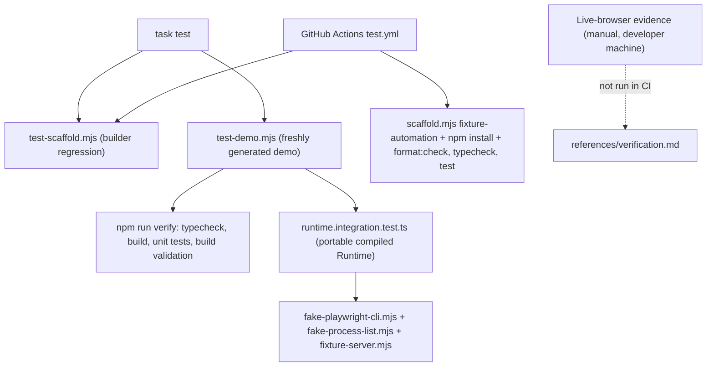

# Testing and verification

The repository verifies its generated automations in two clearly separated lanes.
The **automated lane** is browser-free: `task test` and the GitHub Actions
workflow (`.github/workflows/test.yml`) run the website-automation-builder
regression suite — `test-scaffold.mjs` and the freshly generated demo — and the
demo's own unit, build-validation, and subprocess integration tests, all
`node --test` invocations with no browser, no `node_modules` dependency for the
portable runtime, and no live site. The **live lane** is separate manual
evidence, captured on the developer's own machine against the demo's localhost
fixture or a real site, and documented in the generated skill's
`references/verification.md`. It never runs under CI and is explicitly not
evidence for any external production website.

The operating rule (AGENTS.md): *prefer the narrowest quiet validation that
proves the changed behavior, and preserve complete failure output.* This page
maps each test file to the behavior it guards and keeps the two lanes distinct.



*Caption: The two verification lanes — the automated browser-free regression
suite driven by `task test` and CI, and the separate manual live-browser
evidence documented in `references/verification.md`.*

## The automated, browser-free lane

The entry point is `Taskfile.yml`'s `test` task, which runs two builder scripts
in sequence:

```bash
task test
# → node skills/website-automation-builder/scripts/test-scaffold.mjs
# → node skills/website-automation-builder/scripts/test-demo.mjs
```

`test-scaffold.mjs` is the builder regression harness: it checks the scaffold
templates and asset contracts that generation depends on, without a browser.
`test-demo.mjs` instantiates the builder's bundled demo (a freshly generated
skill, mirrored in the repository at `artifacts/demo-automation/`) and runs its
full local verification. Together they prove the generation path still produces
a buildable, portable, self-validating skill.

CI mirrors the same ground truth in `.github/workflows/test.yml` on
`[push, pull_request]`, using `actions/setup-node` with Node 22:

```yaml
- uses: actions/checkout@v4
- uses: actions/setup-node@v4
  with: { node-version: 22 }
- run: node skills/website-automation-builder/scripts/test-scaffold.mjs
- run: |
    target="$(mktemp -d)/fixture-automation"
    node skills/website-automation-builder/scripts/scaffold.mjs --name fixture-automation --url https://example.org --out "$target"
    npm --prefix "$target" install --ignore-scripts
    npm --prefix "$target" run format:check
    npm --prefix "$target" run typecheck
    npm --prefix "$target" test
```

Note that CI installs **no** Playwright CLI and opens **no** browser; it
generates a throwaway skill, checks formatting and types, and runs the skill's
own `test` script. The entire pipeline is quiet and browser-free.

### The generated demo's `verify` chain

Each generated skill ships a `verify` script that chains the four automated
checks (see the demo's `package.json`):

```bash
"verify": "npm run typecheck && npm run build && npm test && npm run validate"
# "test": "node --experimental-strip-types --test --test-concurrency=1 tests/*.test.ts"
```

`typecheck` (tsc), `build` (esbuild precompile of the POM/action bundles),
`test` (the `node --test` unit + integration suite), and `validate`
(build-validation, confirming precompiled bundles match their manifest) are all
local and browser-free. The generated demo instantiates the builder's shared
site-template test set plus the portable integration test, so its `tests/`
directory contains `engine`, `cli-browser`, `browser-entry`, `fingerprint`,
`guards`, `input`, and `cli` tests, plus `runtime.integration.test.ts` and the
fixture doubles.

## The portable runtime integration test

`runtime.integration.test.ts` is the centerpiece of the browser-free lane. It
proves the **portable compiled Runtime** works through an *executable*
playwright-cli protocol fixture, with no browser, no `src`, and no
`node_modules` in the copy under test:

```ts
// Copy the compiled runtime, scripts, and tests into a temp dir, wire the fakes,
// and never touch src/node_modules in that copy.
manifest.config.browser.cliScript = join(root, "tests/fake-playwright-cli.mjs");
const fresh = () => ({ account: "fixture-account", version: 1, scenario: "normal", attached: false, calls: [] });
function run(...args: string[]) {
  return spawnSync(process.execPath, [join(root, "scripts/site-runtime.mjs"), ...args], {
    cwd: tmpdir(), encoding: "utf8", timeout: 15000,
    env: { ...process.env, SITE_FIXTURE_STATE: statePath,
           PATH: join(root, "bin") + delimiter + process.env.PATH },
  });
}
```

It assembles a private environment: it copies `runtime/`, `scripts/`, and
`tests/` into a fresh temp dir, points the manifest's `browser.cliScript` at
`fake-playwright-cli.mjs`, and prepends a private `bin/` (holding
`fake-process-list.mjs` as `ps`) to `PATH`. It then drives the real
`site-runtime.mjs` CLI end-to-end, asserting single-line JSON envelopes and the
recorded CLI call log. The subtests cover the full behavior matrix:

- **No-browser introspection** — `list` and `describe` work with no browser,
  dependencies, or sources.
- **Pre-browser failure** — invalid inputs, unknown actions, raw `click` /
  `run-code`, and mode escapes fail before any browser access; the call log
  stays empty.
- **Attach-once, named-session reuse** — the extension attaches exactly once
  with `--extension=chrome`; no `open`/`close`/`--headless` is ever issued.
- **Distinct attach failures** — `BROWSER_REQUIRED`, `ATTACH_FAILED` (for both
  failure and a *managed* session), and `CLI_PROTOCOL` (version mismatch) are
  each asserted as separate errors; CDP mode uses only `--cdp=…`.
- **Compiled POM reads** — `inventory.find` returns `data`, `state`, and
  `next`; an injection-looking SKU returns an empty result without any
  `run-code` file being written.
- **Byte budgets fail closed** — an oversized input is `INVALID_INPUT`; an
  oversized Unicode output is `POSTCONDITION_FAILED` and the envelope stays
  small.
- **Observation is compact and non-mutating** — `status`/`inspect`/
  `inspect-region`/`screenshot`/diagnostic stay within size budgets and do not
  change fixture state; unknown regions are `UNKNOWN_REGION`.
- **Recovery on drift** — `missing`/`ambiguous`/`unknown` UI map to
  `UI_DRIFT`/`AMBIGUOUS_SELECTOR`/`UNSUPPORTED_UI_STATE` with
  `recovery: "inspect-state"`.
- **Write safety lifecycle** — `plan` is non-mutating; a wrong approval hash is
  `APPROVAL_REQUIRED`; a correct execute commits once, then `PLAN_USED`;
  changed account/version/config or expired plans are `PLAN_CHANGED` /
  `PLAN_EXPIRED`; uncertain commit and failed postcondition are `UNKNOWN_COMMIT`
  and never replayed.
- **Artifact integrity** — a tampered precompiled bundle is `BUILD_REQUIRED`
  before transport; a malformed CLI response is `CLI_PROTOCOL`.

The same file ends with a second test that runs the **fixture server** and
asserts it serves the demo HTML over localhost.

### The fixture doubles and fixture server

The integration test's correctness depends on three private, test-only
fixtures:

- **`fake-playwright-cli.mjs`** — an *executable protocol fixture*. It reads the
  `SITE_FIXTURE_STATE` JSON, records every CLI call (redacting `--filename=` to
  `--filename=<private>`), and implements only the pinned CLI surface:
  `--version`, `list`, `attach` (validating the exact named session and attach
  mode), and `run-code` in `--raw` mode (executing the real compiled POM
  wrapper against an in-memory `fixture-page.mjs` DOM double). Any other command
  is rejected with `Forbidden command`. Its `--version` returns the scenario's
  value (`0.0.0` for `wrong-version`), mirroring real CLI `0.1.19`
  `--raw` returned-string encoding.
- **`fake-process-list.mjs`** — a process-inventory double installed only on the
  integration test's private `PATH` (as `ps`). It prints the exact Chrome main
  binary path only when the scenario is not `no-browser`, so the runtime's
  browser-presence check can distinguish a running browser from none.
- **`fixture-server.mjs`** — a localhost HTTP server that serves the demo's
  `inventory.html` at `/` (404 elsewhere) and emits the bound port as JSON. It
  is the target for *live* browser evidence, and is separately asserted by the
  integration test to serve its HTML.

These fixtures are wired in **only** by the integration test's configuration;
the distributed runtime points at the real pinned CLI, so the doubles never
leak into a shipped skill.

## The cardmarket unit tests

`skills/cardmarket-automation/tests/` holds the maintained skill's browser-free
unit tests:

```text
actions.test.ts  cli.test.ts  engine.test.ts  fingerprint.test.ts
guards.test.ts   input.test.ts  parse.test.ts  seller-filters.test.ts
```

The runtime-derived tests — `engine`, `fingerprint`, `guards`, `input`, and
`cli` — are the same shared site-template components the demo instantiates, and
they guard the same invariants (the write-safety lifecycle, fingerprint
invalidation on source/lockfile change, unique-locator and origin validation,
input allowlisting without coercion, and the CLI envelope). The site-specific
tests — `actions`, `parse`, and `seller-filters` — cover the cardmarket POM
actions, result parsing, and the seller-offer filter logic. Like the demo's
suite, these run under `node --test` with no browser.

```text
# Shared runtime components guarded by unit tests (demo + cardmarket)
engine      → write-safety lifecycle (plan/guard/execute, replay)
fingerprint → source + lockfile change invalidates implementation fingerprint
guards      → uniqueVisible/clickUnique/fillUnique, allowedURL origin checks
input       → validateInput/validateFields/jsonValue (allowlist, no coercion)
cli         → single-line JSON envelope, structured INVALID_INPUT, browser-free ops
```

*Caption: The shared runtime components, each guarded by a unit test in both
the generated demo and the cardmarket skill.*

## Keeping live-browser evidence separate

The automated lane never opens a browser. Live-browser verification is a
deliberate, separate manual step run on the developer's own machine, and its
result is recorded in the generated skill's `references/verification.md` rather
than anywhere CI can run. For the demo, that document records what was checked
on a real browser attached to the localhost fixture — extension attach,
named-session reuse, `doctor`, `status`, `inspect`, diagnostic `inspect`,
`inspect-region`, screenshot, a read with a hit and an empty result, and the
non-mutating `inventory.update-title` plan — while noting that `execute` was
**intentionally not called**, so no real browser write occurred, and that this
local fixture is *not* evidence for an external production website.

The separation rests on three boundaries:

- **Runner** — automated checks run under `task test` and CI (headless, no
  browser, no CLI install); live evidence is a manual, user-present step.
- **Target** — automated checks use in-memory fixture doubles and the localhost
  fixture server; live evidence attaches to a real, already-open browser.
- **Record** — automated results are pass/fail test output; live evidence is a
  dated narrative in `references/verification.md`, explicitly scoped so it is
  never mistaken for production-site proof.

Because the README and CI both stop at the browser-free suite, and the
generated skill's own docs carry the live narrative, a reader can always tell
which lane produced a given claim.

## Invariants the suite guards

Across both skills and the demo, the browser-free suite pins the load-bearing
invariants a safe change must preserve:

- **Attach-only, attach-once** — the runtime reuses its fixed named session and
  never launches, replaces, or closes a browser; distinct failures
  (`BROWSER_REQUIRED`, `ATTACH_FAILED`, `CLI_PROTOCOL`) stay distinguishable.
- **Pinned CLI protocol** — behavior is bound to the pinned Playwright CLI
  (`0.1.19`); a version mismatch is a protocol failure, not a silent upgrade.
- **Pre-browser failure** — invalid input, unknown actions, raw mutation, and
  mode escapes fail before any browser or write is touched.
- **Input/byte budgets fail closed** — oversized or malformed input is
  rejected; oversized output is bounded; input is allowlisted without coercion.
- **Compact, non-mutating observation** — observation stays within size
  budgets, is regional, and never mutates state.
- **Write-safety lifecycle** — plans are non-mutating; approval is hash-bound
  and one-shot; `PLAN_CHANGED`, `PLAN_EXPIRED`, `PLAN_USED`, and
  `UNKNOWN_COMMIT` are never replayed.
- **Artifact integrity** — a tampered precompiled bundle is `BUILD_REQUIRED`
  before transport; a malformed CLI response fails closed.
- **Implementation fingerprint** — any source or lockfile change invalidates
  the fingerprint, forcing a rebuild.

These are the behaviors a regression must catch: when any of them changes, the
narrowest quiet validation that proves the changed behavior — with complete
failure output preserved — is the right check, and it is always one of these
browser-free suites, never a live browser run.
